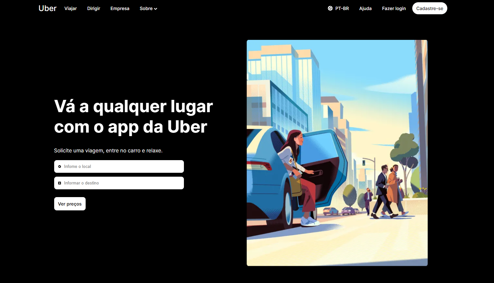

<h1 align="center"> Projeto UberClonex </h1>

Projeto criado por mim como um Challange.

  <a href="#-tecnologias">Tecnologias</a>&nbsp;&nbsp;&nbsp;|&nbsp;&nbsp;&nbsp;
  <a href="#-projeto">Projeto</a>&nbsp;&nbsp;&nbsp;|&nbsp;&nbsp;&nbsp;
  <a href="#-licença">Licença</a>

  

 

  

## 🚀 Tecnologias

Esse projeto foi desenvolvido com as seguintes tecnologias:

- HTML e CSS
- Git e Github
- Figma

## 💻 Projeto

O projeto UberClonex é um projeto onde eu busquei analizar e codar a página inicial da empresa Uber, criei a landing page principal do site com todos os seus estilos e interações com o usuário. Acesse o projeto [AQUI](https://yuriverwiebe.github.io/UberClonex)

## 📝 Licença

Esse projeto está sob a licença MIT.

---

Feito com ♥ by Yuri Verwiebe 🌊
